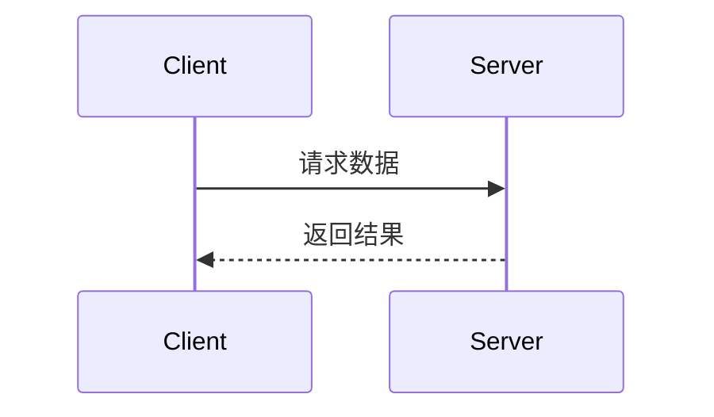
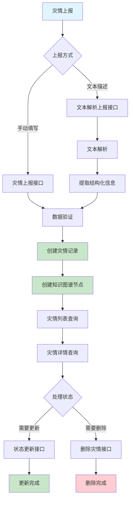
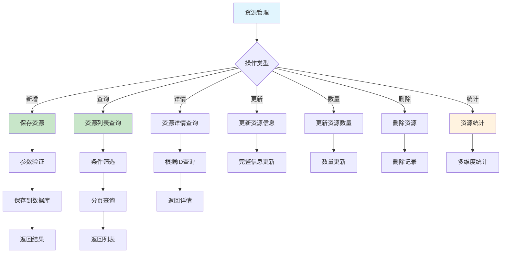

# 灾害应急资源匹配平台 API 接口文档

## 📋 接口概述

**项目名称**: 基于知识图谱的灾害应急资源智能匹配系统  
**版本**: v1.0.0  
**基础URL**: `http://localhost:8080/api`  
**接口风格**: RESTful API  
**数据格式**: JSON  

## 📖 API文档规范

### 文档同步要求
**当生成或修改API接口时，以下内容变更必须同步更新API文档：**
- 入参结构变更
- 返回参数变更  
- URL地址变更
- 请求方式变更

### 文档格式标准

#### 基本信息
```markdown
## 接口名称

**接口名称：** 简短描述接口功能
**功能描述：** 详细描述接口的业务用途
**接口地址：** /api/endpoint
**请求方式：** GET/POST
```

#### 功能说明
```markdown
### 功能说明
详细描述接口的业务逻辑，可以使用流程图或时序图：



#### 请求参数
```markdown
### 请求参数
```json
{
  "page": 1,
  "page_size": 10,
  "status": "active"
}
```

| 参数名 | 类型 | 必填 | 说明 | 示例值 |
|-------|------|-----|------|--------|
| page | int | 否 | 页码（默认1） | 2 |
| page_size | int | 否 | 每页数量（默认10） | 20 |
| status | string | 否 | 状态过滤 | active |
```

#### 响应参数
```markdown
### 响应参数
```json
{
  "error": 0,
  "body": {
    "user_id": 1,
    "username": "admin",
    "email": "admin@example.com",
    "status": "active"
  },
  "message": "获取用户基本信息成功",
  "success": true
}
```

| 参数名 | 类型 | 必填 | 说明 | 示例值 |
|-------|------|-----|------|--------|
| error | int | 是 | 错误码 | 0 |
| body | object | 是 | 响应数据 | |
| body.user_id | int | 是 | 用户ID | 1 |
| body.username | string | 是 | 用户名 | admin |
| body.email | string | 是 | 邮箱 | admin@example.com |
| body.status | string | 是 | 用户状态 | active |
| message | string | 是 | 响应消息 | 获取用户基本信息成功 |
| success | bool | 是 | 是否成功 | true |
```

**注意：** 如果body是对象，需要列出所有子字段，格式为 `body.字段名`

## 📚 接口分类

### 1. 用户管理接口
### 2. 灾情管理接口
### 3. 需求管理接口
### 4. 资源管理接口
### 5. 知识图谱接口
### 6. 文本解析接口
### 7. 相似度计算接口
### 8. 匹配调度接口
### 9. 统计分析接口

---

## 1. 用户管理接口

### 1.1 用户登录

**接口名称**: 用户登录  
**功能描述**: 用户通过用户名和密码登录系统  
**接口地址**: `/user/login`  
**请求方式**: `POST`  

#### 请求参数
```json
{
  "username": "admin",
  "password": "admin123"
}
```

| 参数名 | 类型 | 必填 | 说明 | 示例值 |
|-------|------|-----|------|--------|
| username | string | 是 | 用户名 | admin |
| password | string | 是 | 密码 | admin123 |

#### 响应参数
```json
{
  "code": 200,
  "message": "登录成功",
  "data": {
    "user": {
      "id": 1,
      "username": "admin",
      "realName": "系统管理员",
      "role": "command_center",
      "status": "active"
    }
  }
}
```

### 1.2 用户注册

**接口名称**: 用户注册  
**功能描述**: 新用户注册账号  
**接口地址**: `/user/register`  
**请求方式**: `POST`  

#### 请求参数
```json
{
  "username": "test_user",
  "password": "test123",
  "realName": "测试用户",
  "phone": "13800138000",
  "email": "test@example.com",
  "role": "civilian"
}
```

---

## 2. 灾情管理接口

### 灾情处理流程图



### 2.1 灾情上报

**接口名称**: 灾情上报  
**功能描述**: 上报新的灾害信息  
**接口地址**: `/disaster/report`  
**请求方式**: `POST`  

#### 功能说明
该接口用于上报新的灾害信息，支持手动填写灾情详情。系统会对上报的数据进行验证，包括必填字段检查、手机号格式验证等。上报成功后，系统会自动创建灾情记录并分配唯一ID。

#### 请求参数
```json
{
  "disasterType": "地震",
  "occurTime": "2024-01-01 08:00:00",
  "province": "四川省",
  "city": "成都市",
  "district": "都江堰市",
  "severity": "严重",
  "description": "7.0级地震，多处房屋倒塌",
  "reporterName": "张三",
  "reporterPhone": "13800138000"
}
```

| 参数名 | 类型 | 必填 | 说明 | 示例值 |
|-------|------|-----|------|--------|
| disasterType | string | 是 | 灾害类型（地震、洪水、火灾、台风等） | 地震 |
| occurTime | string | 否 | 灾害发生时间（默认当前时间） | 2024-01-01 08:00:00 |
| province | string | 是 | 省份 | 四川省 |
| city | string | 是 | 城市 | 成都市 |
| district | string | 是 | 区县 | 都江堰市 |
| severity | string | 是 | 严重程度（轻微、一般、严重、特别严重） | 严重 |
| description | string | 否 | 灾情详细描述 | 7.0级地震，多处房屋倒塌 |
| reporterName | string | 否 | 上报人姓名 | 张三 |
| reporterPhone | string | 否 | 上报人手机号（需符合手机号格式） | 13800138000 |

#### 响应参数
```json
{
  "code": 200,
  "message": "灾情上报成功",
  "data": {
    "id": 1,
    "disasterType": "地震",
    "occurTime": "2024-01-01T08:00:00",
    "province": "四川省",
    "city": "成都市",
    "district": "都江堰市",
    "severity": "严重",
    "status": "active",
    "createTime": "2024-01-01T10:00:00"
  }
}
```

### 2.2 文本解析灾情上报

**接口名称**: 文本解析灾情上报  
**功能描述**: 通过文本解析自动提取灾情信息并上报  
**接口地址**: `/disaster/report-with-parse`  
**请求方式**: `POST`  

#### 功能说明
该接口结合了文本解析和灾情上报功能，用户只需提供原始文本描述，系统会自动解析出灾害类型、严重程度、地理位置等信息，然后创建灾情记录。同时会在知识图谱中创建对应的节点，便于后续的智能匹配和分析。

#### 请求参数
```json
{
  "originalText": "四川省成都市都江堰市发生7.0级地震，多处房屋倒塌，需要紧急救援"
}
```

| 参数名 | 类型 | 必填 | 说明 | 示例值 |
|-------|------|-----|------|--------|
| originalText | string | 是 | 原始灾情描述文本 | 四川省成都市都江堰市发生7.0级地震，多处房屋倒塌，需要紧急救援 |

#### 响应参数
```json
{
  "code": 200,
  "message": "灾情上报和解析成功",
  "data": {
    "disaster": {
      "id": 1,
      "disasterType": "地震",
      "province": "四川省",
      "city": "成都市",
      "district": "都江堰市",
      "severity": "严重",
      "originalText": "四川省成都市都江堰市发生7.0级地震，多处房屋倒塌，需要紧急救援",
      "parsedData": "{\"disaster_type\":\"地震\",\"severity\":\"严重\",\"location\":\"四川省成都市都江堰市\"}"
    },
    "parseResult": {
      "disaster_type": "地震",
      "severity": "严重",
      "location": "四川省成都市都江堰市"
    },
    "knowledgeNodeId": 1
  }
}
```

### 2.3 文本解析

**接口名称**: 文本解析  
**功能描述**: 解析灾情文本，提取结构化信息  
**接口地址**: `/disaster/parse-text`  
**请求方式**: `POST`  

#### 功能说明
该接口专门用于解析灾情相关的文本内容，提取其中的结构化信息，如灾害类型、严重程度、地理位置等。解析结果可以用于后续的灾情上报或数据分析。该接口仅进行解析，不会创建灾情记录。

#### 请求参数
```json
{
  "originalText": "四川省成都市都江堰市发生7.0级地震，多处房屋倒塌"
}
```

| 参数名 | 类型 | 必填 | 说明 | 示例值 |
|-------|------|-----|------|--------|
| originalText | string | 是 | 需要解析的原始文本 | 四川省成都市都江堰市发生7.0级地震，多处房屋倒塌 |

#### 响应参数
```json
{
  "code": 200,
  "message": "文本解析成功",
  "data": {
    "originalText": "四川省成都市都江堰市发生7.0级地震，多处房屋倒塌",
    "parsedResult": {
      "disaster_type": "地震",
      "severity": "严重",
      "location": "四川省成都市都江堰市"
    },
    "parseTime": "2024-01-01T10:00:00"
  }
}
```

### 2.4 灾情列表查询

**接口名称**: 灾情列表查询  
**功能描述**: 分页查询灾情列表，支持多条件筛选  
**接口地址**: `/disaster/list`  
**请求方式**: `GET`  

#### 功能说明
该接口提供灾情信息的分页查询功能，支持按灾害类型、严重程度、地理位置、处理状态等多个维度进行筛选。系统会根据查询条件返回符合条件的灾情记录列表，并包含分页信息。

#### 请求参数
| 参数名 | 类型 | 必填 | 说明 | 示例值 |
|-------|------|-----|------|--------|
| page | int | 否 | 页码（默认1，最小值1） | 1 |
| size | int | 否 | 每页数量（默认10，范围1-100） | 10 |
| disasterType | string | 否 | 灾害类型筛选 | 地震 |
| severity | string | 否 | 严重程度筛选 | 严重 |
| province | string | 否 | 省份筛选 | 四川省 |
| city | string | 否 | 城市筛选 | 成都市 |
| status | string | 否 | 处理状态筛选 | active |

#### 响应参数
```json
{
  "code": 200,
  "message": "查询成功",
  "data": {
    "total": 50,
    "pages": 5,
    "current": 1,
    "size": 10,
    "records": [
      {
        "id": 1,
        "disasterType": "地震",
        "occurTime": "2024-01-01T08:00:00",
        "province": "四川省",
        "city": "成都市",
        "district": "都江堰市",
        "severity": "严重",
        "status": "active"
      }
    ]
  }
}
```

### 2.5 灾情详情查询

**接口名称**: 灾情详情查询  
**功能描述**: 根据灾情ID获取详细信息  
**接口地址**: `/disaster/{id}`  
**请求方式**: `GET`  

#### 功能说明
该接口用于获取指定灾情的完整详细信息，包括灾情的基本信息、上报人信息、解析数据等。主要用于灾情详情页面展示和后续处理。

#### 请求参数
| 参数名 | 类型 | 必填 | 说明 | 示例值 |
|-------|------|-----|------|--------|
| id | long | 是 | 灾情ID（路径参数） | 1 |

#### 响应参数
```json
{
  "code": 200,
  "message": "查询成功",
  "data": {
    "id": 1,
    "disasterType": "地震",
    "occurTime": "2024-01-01T08:00:00",
    "province": "四川省",
    "city": "成都市",
    "district": "都江堰市",
    "severity": "严重",
    "description": "7.0级地震，多处房屋倒塌",
    "originalText": "四川省成都市都江堰市发生7.0级地震，多处房屋倒塌，需要紧急救援",
    "parsedData": "{\"disaster_type\":\"地震\",\"severity\":\"严重\",\"location\":\"四川省成都市都江堰市\"}",
    "reporterName": "张三",
    "reporterPhone": "13800138000",
    "reporterId": 1,
    "status": "active",
    "createTime": "2024-01-01T10:00:00",
    "updateTime": "2024-01-01T10:00:00"
  }
}
```

| 参数名 | 类型 | 必填 | 说明 | 示例值 |
|-------|------|-----|------|--------|
| code | int | 是 | 响应码 | 200 |
| message | string | 是 | 响应消息 | 查询成功 |
| data | object | 是 | 灾情详情数据 | |
| data.id | long | 是 | 灾情ID | 1 |
| data.disasterType | string | 是 | 灾害类型 | 地震 |
| data.occurTime | string | 是 | 发生时间 | 2024-01-01T08:00:00 |
| data.province | string | 是 | 省份 | 四川省 |
| data.city | string | 是 | 城市 | 成都市 |
| data.district | string | 是 | 区县 | 都江堰市 |
| data.severity | string | 是 | 严重程度 | 严重 |
| data.description | string | 否 | 灾情描述 | 7.0级地震，多处房屋倒塌 |
| data.originalText | string | 否 | 原始文本 | 四川省成都市都江堰市发生7.0级地震... |
| data.parsedData | string | 否 | 解析数据 | {"disaster_type":"地震"...} |
| data.reporterName | string | 否 | 上报人姓名 | 张三 |
| data.reporterPhone | string | 否 | 上报人电话 | 13800138000 |
| data.reporterId | long | 否 | 上报人ID | 1 |
| data.status | string | 是 | 处理状态 | active |
| data.createTime | string | 是 | 创建时间 | 2024-01-01T10:00:00 |
| data.updateTime | string | 是 | 更新时间 | 2024-01-01T10:00:00 |

### 2.6 灾情状态更新

**接口名称**: 灾情状态更新  
**功能描述**: 更新灾情的处理状态  
**接口地址**: `/disaster/{id}/status`  
**请求方式**: `PUT`  

#### 功能说明
该接口用于更新灾情的处理状态，支持将灾情状态从"active"（活跃）更新为"resolved"（已解决）、"closed"（已关闭）等状态。主要用于灾情处理流程中的状态管理。

#### 请求参数
| 参数名 | 类型 | 必填 | 说明 | 示例值 |
|-------|------|-----|------|--------|
| id | long | 是 | 灾情ID（路径参数） | 1 |
| status | string | 是 | 新的处理状态 | resolved |

#### 请求体
```json
{
  "status": "resolved"
}
```

#### 响应参数
```json
{
  "code": 200,
  "message": "状态更新成功",
  "data": {
    "id": 1,
    "status": "resolved",
    "updateTime": "2024-01-01T12:00:00"
  }
}
```

| 参数名 | 类型 | 必填 | 说明 | 示例值 |
|-------|------|-----|------|--------|
| code | int | 是 | 响应码 | 200 |
| message | string | 是 | 响应消息 | 状态更新成功 |
| data | object | 是 | 更新结果数据 | |
| data.id | long | 是 | 灾情ID | 1 |
| data.status | string | 是 | 更新后的状态 | resolved |
| data.updateTime | string | 是 | 更新时间 | 2024-01-01T12:00:00 |

### 2.7 删除灾情

**接口名称**: 删除灾情  
**功能描述**: 根据灾情ID删除灾情记录  
**接口地址**: `/disaster/{id}`  
**请求方式**: `DELETE`  

#### 功能说明
该接口用于删除指定的灾情记录。删除操作会永久移除灾情数据，请谨慎使用。通常用于清理测试数据或处理重复上报的情况。

#### 请求参数
| 参数名 | 类型 | 必填 | 说明 | 示例值 |
|-------|------|-----|------|--------|
| id | long | 是 | 灾情ID（路径参数） | 1 |

#### 响应参数
```json
{
  "code": 200,
  "message": "删除成功",
  "data": {
    "id": 1,
    "deleteTime": "2024-01-01T15:00:00"
  }
}
```

| 参数名 | 类型 | 必填 | 说明 | 示例值 |
|-------|------|-----|------|--------|
| code | int | 是 | 响应码 | 200 |
| message | string | 是 | 响应消息 | 删除成功 |
| data | object | 是 | 删除结果数据 | |
| data.id | long | 是 | 被删除的灾情ID | 1 |
| data.deleteTime | string | 是 | 删除时间 | 2024-01-01T15:00:00 |

### 灾情管理接口总结

| 接口名称 | 接口地址 | 请求方式 | 功能描述 | 主要用途 |
|---------|---------|---------|---------|---------|
| 灾情上报 | `/disaster/report` | POST | 手动填写灾情信息并上报 | 标准灾情上报流程 |
| 文本解析灾情上报 | `/disaster/report-with-parse` | POST | 通过文本解析自动提取信息并上报 | 快速灾情上报，支持自然语言描述 |
| 文本解析 | `/disaster/parse-text` | POST | 仅解析文本，不创建记录 | 文本解析测试和预览 |
| 灾情列表查询 | `/disaster/list` | GET | 分页查询灾情列表 | 灾情列表展示和筛选 |
| 灾情详情查询 | `/disaster/{id}` | GET | 获取指定灾情详细信息 | 灾情详情页面展示 |
| 灾情状态更新 | `/disaster/{id}/status` | PUT | 更新灾情处理状态 | 灾情处理流程管理 |
| 删除灾情 | `/disaster/{id}` | DELETE | 删除指定灾情记录 | 数据清理和重复处理 |
| 灾情统计 | `/disaster/statistics` | GET | 获取灾情统计数据 | 数据分析和报表展示 |

### 2.8 灾情统计

**接口名称**: 灾情统计  
**功能描述**: 获取灾情统计数据  
**接口地址**: `/disaster/statistics`  
**请求方式**: `GET`  

#### 功能说明
该接口用于获取灾情的统计信息，包括总数、各状态数量、按灾害类型和严重程度的分布统计等。主要用于数据分析和报表展示。

#### 响应参数
```json
{
  "code": 200,
  "message": "获取灾情统计成功",
  "data": {
    "totalDisasters": 50,
    "activeDisasters": 20,
    "resolvedDisasters": 25,
    "closedDisasters": 5,
    "disasterTypeStats": {
      "地震": 15,
      "洪水": 20,
      "火灾": 10,
      "台风": 5
    },
    "severityStats": {
      "轻微": 10,
      "一般": 20,
      "严重": 15,
      "特别严重": 5
    }
  }
}
```

| 参数名 | 类型 | 必填 | 说明 | 示例值 |
|-------|------|-----|------|--------|
| code | int | 是 | 响应码 | 200 |
| message | string | 是 | 响应消息 | 获取灾情统计成功 |
| data | object | 是 | 统计数据 | |
| data.totalDisasters | long | 是 | 总灾情数 | 50 |
| data.activeDisasters | long | 是 | 活跃灾情数 | 20 |
| data.resolvedDisasters | long | 是 | 已解决灾情数 | 25 |
| data.closedDisasters | long | 是 | 已关闭灾情数 | 5 |
| data.disasterTypeStats | object | 是 | 按灾害类型统计 | |
| data.disasterTypeStats.地震 | long | 是 | 地震数量 | 15 |
| data.disasterTypeStats.洪水 | long | 是 | 洪水数量 | 20 |
| data.severityStats | object | 是 | 按严重程度统计 | |
| data.severityStats.轻微 | long | 是 | 轻微程度数量 | 10 |
| data.severityStats.一般 | long | 是 | 一般程度数量 | 20 |

---

## 3. 需求管理接口

### 3.1 需求提交

**接口名称**: 需求提交  
**功能描述**: 提交救援需求信息  
**接口地址**: `/demand/submit`  
**请求方式**: `POST`  

#### 请求参数
```json
{
  "disasterId": 1,
  "demandType": "帐篷",
  "quantity": 100,
  "unit": "顶",
  "urgency": "紧急",
  "province": "四川省",
  "city": "成都市",
  "district": "都江堰市",
  "description": "需要100顶帐篷安置灾民",
  "deadline": "2024-01-02 18:00:00"
}
```

#### 响应参数
```json
{
  "code": 200,
  "message": "需求提交成功",
  "data": {
    "id": 1,
    "disasterId": 1,
    "demandType": "帐篷",
    "quantity": 100,
    "unit": "顶",
    "urgency": "紧急",
    "status": "pending",
    "createTime": "2024-01-01T10:00:00"
  }
}
```

### 3.2 需求列表查询

**接口名称**: 需求列表查询  
**功能描述**: 分页查询需求列表，支持多条件筛选  
**接口地址**: `/demand/list`  
**请求方式**: `GET`  

#### 请求参数
| 参数名 | 类型 | 必填 | 说明 | 示例值 |
|-------|------|-----|------|--------|
| page | int | 否 | 页码（默认1） | 1 |
| size | int | 否 | 每页数量（默认10） | 10 |
| disasterId | long | 否 | 灾情ID | 1 |
| demandType | string | 否 | 需求类型 | 帐篷 |
| urgency | string | 否 | 紧急程度 | 紧急 |
| status | string | 否 | 状态 | pending |
| province | string | 否 | 省份 | 四川省 |
| city | string | 否 | 城市 | 成都市 |

#### 响应参数
```json
{
  "code": 200,
  "message": "查询成功",
  "data": {
    "total": 30,
    "pages": 3,
    "current": 1,
    "size": 10,
    "records": [
      {
        "id": 1,
        "disasterId": 1,
        "demandType": "帐篷",
        "quantity": 100,
        "unit": "顶",
        "urgency": "紧急",
        "province": "四川省",
        "city": "成都市",
        "district": "都江堰市",
        "description": "需要100顶帐篷安置灾民",
        "status": "pending",
        "createTime": "2024-01-01T10:00:00",
        "updateTime": "2024-01-01T10:00:00"
      }
    ]
  }
}
```

### 3.3 需求详情查询

**接口名称**: 需求详情查询  
**功能描述**: 根据ID查询需求详细信息  
**接口地址**: `/demand/{id}`  
**请求方式**: `GET`  

#### 请求参数
| 参数名 | 类型 | 必填 | 说明 | 示例值 |
|-------|------|-----|------|--------|
| id | long | 是 | 需求ID | 1 |

#### 响应参数
```json
{
  "code": 200,
  "message": "查询成功",
  "data": {
    "id": 1,
    "disasterId": 1,
    "demandType": "帐篷",
    "quantity": 100,
    "unit": "顶",
    "urgency": "紧急",
    "province": "四川省",
    "city": "成都市",
    "district": "都江堰市",
    "description": "需要100顶帐篷安置灾民",
    "status": "pending",
    "createTime": "2024-01-01T10:00:00",
    "updateTime": "2024-01-01T10:00:00"
  }
}
```

### 3.4 需求更新

**接口名称**: 需求更新  
**功能描述**: 更新需求信息  
**接口地址**: `/demand/update`  
**请求方式**: `PUT`  

#### 请求参数
```json
{
  "id": 1,
  "disasterId": 1,
  "demandType": "帐篷",
  "quantity": 150,
  "unit": "顶",
  "urgency": "紧急",
  "province": "四川省",
  "city": "成都市",
  "district": "都江堰市",
  "description": "需要150顶帐篷安置灾民",
  "status": "processing"
}
```

#### 响应参数
```json
{
  "code": 200,
  "message": "更新成功",
  "data": {
    "id": 1,
    "disasterId": 1,
    "demandType": "帐篷",
    "quantity": 150,
    "unit": "顶",
    "urgency": "紧急",
    "province": "四川省",
    "city": "成都市",
    "district": "都江堰市",
    "description": "需要150顶帐篷安置灾民",
    "status": "processing",
    "createTime": "2024-01-01T10:00:00",
    "updateTime": "2024-01-01T11:00:00"
  }
}
```

### 3.5 需求状态更新

**接口名称**: 需求状态更新  
**功能描述**: 更新需求处理状态  
**接口地址**: `/demand/status`  
**请求方式**: `PUT`  

#### 请求参数
| 参数名 | 类型 | 必填 | 说明 | 示例值 |
|-------|------|-----|------|--------|
| id | long | 是 | 需求ID | 1 |
| status | string | 是 | 新状态 | processing |

#### 状态说明
- `pending`: 待处理
- `processing`: 处理中
- `completed`: 已完成
- `cancelled`: 已取消

#### 响应参数
```json
{
  "code": 200,
  "message": "状态更新成功",
  "data": null
}
```

### 3.6 需求删除

**接口名称**: 需求删除  
**功能描述**: 根据ID删除需求  
**接口地址**: `/demand/{id}`  
**请求方式**: `DELETE`  

#### 请求参数
| 参数名 | 类型 | 必填 | 说明 | 示例值 |
|-------|------|-----|------|--------|
| id | long | 是 | 需求ID | 1 |

#### 响应参数
```json
{
  "code": 200,
  "message": "删除成功",
  "data": null
}
```

### 3.7 需求统计

**接口名称**: 需求统计  
**功能描述**: 获取需求统计信息  
**接口地址**: `/demand/statistics`  
**请求方式**: `GET`  

#### 请求参数
| 参数名 | 类型 | 必填 | 说明 | 示例值 |
|-------|------|-----|------|--------|
| startTime | string | 否 | 开始时间 | 2024-01-01 00:00:00 |
| endTime | string | 否 | 结束时间 | 2024-01-31 23:59:59 |
| province | string | 否 | 省份 | 四川省 |
| city | string | 否 | 城市 | 成都市 |

#### 响应参数
```json
{
  "code": 200,
  "message": "统计查询成功",
  "data": {
    "totalCount": 100,
    "statusStats": {
      "pending": 30,
      "processing": 40,
      "completed": 25,
      "cancelled": 5
    },
    "urgencyStats": {
      "low": 10,
      "medium": 30,
      "high": 40,
      "urgent": 20
    }
  }
}
```

### 3.8 按类型统计需求

**接口名称**: 按类型统计需求  
**功能描述**: 按需求类型统计需求数量  
**接口地址**: `/demand/statistics/by-type`  
**请求方式**: `GET`  

#### 请求参数
| 参数名 | 类型 | 必填 | 说明 | 示例值 |
|-------|------|-----|------|--------|
| startTime | string | 否 | 开始时间 | 2024-01-01 00:00:00 |
| endTime | string | 否 | 结束时间 | 2024-01-31 23:59:59 |

#### 响应参数
```json
{
  "code": 200,
  "message": "统计查询成功",
  "data": [
    {
      "demandType": "帐篷",
      "count": 50
    },
    {
      "demandType": "食品",
      "count": 30
    },
    {
      "demandType": "医疗用品",
      "count": 20
    }
  ]
}
```

### 3.9 按紧急程度统计需求

**接口名称**: 按紧急程度统计需求  
**功能描述**: 按紧急程度统计需求数量  
**接口地址**: `/demand/statistics/by-urgency`  
**请求方式**: `GET`  

#### 请求参数
| 参数名 | 类型 | 必填 | 说明 | 示例值 |
|-------|------|-----|------|--------|
| startTime | string | 否 | 开始时间 | 2024-01-01 00:00:00 |
| endTime | string | 否 | 结束时间 | 2024-01-31 23:59:59 |

#### 响应参数
```json
{
  "code": 200,
  "message": "统计查询成功",
  "data": [
    {
      "urgency": "urgent",
      "count": 25
    },
    {
      "urgency": "high",
      "count": 40
    },
    {
      "urgency": "medium",
      "count": 30
    },
    {
      "urgency": "low",
      "count": 5
    }
  ]
}
```

---

## 4. 资源管理接口

### 资源管理流程图



### 4.1 保存资源

**接口名称**: 保存资源  
**功能描述**: 新增或更新资源信息  
**接口地址**: `/resource/save`  
**请求方式**: `POST`  

#### 功能说明
该接口用于新增或更新资源信息，支持完整的参数验证，包括必填字段检查、数据格式验证、业务逻辑验证等。系统会自动设置资源的默认状态为"available"，并记录创建和更新时间。

#### 请求参数
```json
{
  "resourceType": "医疗设备",
  "resourceName": "呼吸机",
  "totalQuantity": 100,
  "availableQuantity": 80,
  "unit": "台",
  "province": "北京市",
  "city": "北京市",
  "district": "朝阳区",
  "warehouseName": "中央仓库",
  "contactPerson": "张三",
  "contactPhone": "13800138000",
  "organizationId": 1,
  "priorityLevel": 3
}
```

| 参数名 | 类型 | 必填 | 说明 | 示例值 |
|-------|------|-----|------|--------|
| resourceType | string | 是 | 资源类型 | 医疗设备 |
| resourceName | string | 是 | 资源名称 | 呼吸机 |
| totalQuantity | int | 是 | 总数量（不能为负数） | 100 |
| availableQuantity | int | 是 | 可用数量（不能为负数，不能超过总数量） | 80 |
| unit | string | 是 | 单位 | 台 |
| province | string | 是 | 省份 | 北京市 |
| city | string | 是 | 城市 | 北京市 |
| district | string | 是 | 区县 | 朝阳区 |
| warehouseName | string | 否 | 仓库名称 | 中央仓库 |
| contactPerson | string | 否 | 联系人 | 张三 |
| contactPhone | string | 否 | 联系电话（需符合手机号格式） | 13800138000 |
| organizationId | long | 否 | 所属组织ID | 1 |
| priorityLevel | int | 否 | 优先级等级(1-5) | 3 |

#### 响应参数
```json
{
  "code": 200,
  "message": "资源保存成功",
  "data": {
    "id": 1,
    "resourceType": "医疗设备",
    "resourceName": "呼吸机",
    "totalQuantity": 100,
    "availableQuantity": 80,
    "unit": "台",
    "province": "北京市",
    "city": "北京市",
    "district": "朝阳区",
    "warehouseName": "中央仓库",
    "contactPerson": "张三",
    "contactPhone": "13800138000",
    "organizationId": 1,
    "priorityLevel": 3,
    "status": "available",
    "createTime": "2024-01-01T10:00:00",
    "updateTime": "2024-01-01T10:00:00"
  }
}
```

### 4.2 资源列表查询

**接口名称**: 资源列表查询  
**功能描述**: 分页查询资源信息，支持多条件筛选  
**接口地址**: `/resource/list`  
**请求方式**: `GET`  

#### 功能说明
该接口提供资源信息的分页查询功能，支持按资源类型、状态、地理位置、组织等多个维度进行筛选。系统会根据查询条件返回符合条件的资源记录列表，并包含分页信息。

#### 请求参数
| 参数名 | 类型 | 必填 | 说明 | 示例值 |
|-------|------|-----|------|--------|
| page | int | 否 | 页码（默认1，最小值1） | 1 |
| size | int | 否 | 每页数量（默认10，范围1-100） | 10 |
| resourceType | string | 否 | 资源类型筛选 | 医疗设备 |
| status | string | 否 | 资源状态筛选 | available |
| province | string | 否 | 省份筛选 | 北京市 |
| city | string | 否 | 城市筛选 | 北京市 |
| district | string | 否 | 区县筛选 | 朝阳区 |
| organizationId | long | 否 | 组织ID筛选 | 1 |
| resourceName | string | 否 | 资源名称（支持模糊查询） | 呼吸机 |

#### 响应参数
```json
{
  "code": 200,
  "message": "查询成功",
  "data": {
    "total": 50,
    "pages": 5,
    "current": 1,
    "size": 10,
    "records": [
      {
        "id": 1,
        "resourceType": "医疗设备",
        "resourceName": "呼吸机",
        "totalQuantity": 100,
        "availableQuantity": 80,
        "unit": "台",
        "province": "北京市",
        "city": "北京市",
        "district": "朝阳区",
        "warehouseName": "中央仓库",
        "contactPerson": "张三",
        "contactPhone": "13800138000",
        "organizationId": 1,
        "priorityLevel": 3,
        "status": "available",
        "createTime": "2024-01-01T10:00:00",
        "updateTime": "2024-01-01T10:00:00"
      }
    ]
  }
}
```

### 4.3 资源详情查询

**接口名称**: 资源详情查询  
**功能描述**: 根据ID查询资源详细信息  
**接口地址**: `/resource/{id}`  
**请求方式**: `GET`  

#### 功能说明
该接口用于获取指定资源的完整详细信息，包括资源的基本信息、联系方式、组织信息等。主要用于资源详情页面展示和后续处理。

#### 请求参数
| 参数名 | 类型 | 必填 | 说明 | 示例值 |
|-------|------|-----|------|--------|
| id | long | 是 | 资源ID（路径参数） | 1 |

#### 响应参数
```json
{
  "code": 200,
  "message": "查询成功",
  "data": {
    "id": 1,
    "resourceType": "医疗设备",
    "resourceName": "呼吸机",
    "totalQuantity": 100,
    "availableQuantity": 80,
    "unit": "台",
    "province": "北京市",
    "city": "北京市",
    "district": "朝阳区",
    "warehouseName": "中央仓库",
    "contactPerson": "张三",
    "contactPhone": "13800138000",
    "organizationId": 1,
    "priorityLevel": 3,
    "status": "available",
    "createTime": "2024-01-01T10:00:00",
    "updateTime": "2024-01-01T10:00:00"
  }
}
```

### 4.4 更新资源信息

**接口名称**: 更新资源信息  
**功能描述**: 更新资源的完整信息  
**接口地址**: `/resource/{id}`  
**请求方式**: `PUT`  

#### 功能说明
该接口用于更新资源的完整信息，支持修改资源的所有字段。系统会进行参数验证，确保数据的完整性和正确性。

#### 请求参数
| 参数名 | 类型 | 必填 | 说明 | 示例值 |
|-------|------|-----|------|--------|
| id | long | 是 | 资源ID（路径参数） | 1 |

#### 请求体
```json
{
  "resourceType": "医疗设备",
  "resourceName": "呼吸机",
  "totalQuantity": 120,
  "availableQuantity": 90,
  "unit": "台",
  "province": "北京市",
  "city": "北京市",
  "district": "朝阳区",
  "warehouseName": "中央仓库",
  "contactPerson": "李四",
  "contactPhone": "13900139000",
  "organizationId": 1,
  "priorityLevel": 4
}
```

#### 响应参数
```json
{
  "code": 200,
  "message": "资源更新成功",
  "data": {
    "id": 1,
    "resourceType": "医疗设备",
    "resourceName": "呼吸机",
    "totalQuantity": 120,
    "availableQuantity": 90,
    "unit": "台",
    "province": "北京市",
    "city": "北京市",
    "district": "朝阳区",
    "warehouseName": "中央仓库",
    "contactPerson": "李四",
    "contactPhone": "13900139000",
    "organizationId": 1,
    "priorityLevel": 4,
    "status": "available",
    "createTime": "2024-01-01T10:00:00",
    "updateTime": "2024-01-01T11:00:00"
  }
}
```

### 4.5 更新资源数量

**接口名称**: 更新资源数量  
**功能描述**: 更新资源的可用数量  
**接口地址**: `/resource/{id}/quantity`  
**请求方式**: `PUT`  

#### 功能说明
该接口专门用于更新资源的可用数量，通常用于资源分配、消耗或补充等场景。系统会验证可用数量不能超过总数量。

#### 请求参数
| 参数名 | 类型 | 必填 | 说明 | 示例值 |
|-------|------|-----|------|--------|
| id | long | 是 | 资源ID（路径参数） | 1 |
| availableQuantity | int | 是 | 新的可用数量 | 75 |

#### 请求体
```json
{
  "availableQuantity": 75
}
```

#### 响应参数
```json
{
  "code": 200,
  "message": "数量更新成功",
  "data": {
    "id": 1,
    "availableQuantity": 75,
    "updateTime": "2024-01-01T12:00:00"
  }
}
```

### 4.6 删除资源

**接口名称**: 删除资源  
**功能描述**: 根据ID删除资源  
**接口地址**: `/resource/{id}`  
**请求方式**: `DELETE`  

#### 功能说明
该接口用于删除指定的资源记录。删除操作会永久移除资源数据，请谨慎使用。通常用于清理测试数据或处理重复录入的情况。

#### 请求参数
| 参数名 | 类型 | 必填 | 说明 | 示例值 |
|-------|------|-----|------|--------|
| id | long | 是 | 资源ID（路径参数） | 1 |

#### 响应参数
```json
{
  "code": 200,
  "message": "资源删除成功",
  "data": null
}
```

### 4.7 批量删除资源

**接口名称**: 批量删除资源  
**功能描述**: 批量删除多个资源  
**接口地址**: `/resource/batch`  
**请求方式**: `DELETE`  

#### 功能说明
该接口用于批量删除多个资源记录，提高删除效率。请求体中包含要删除的资源ID列表。

#### 请求参数
```json
[1, 2, 3, 4, 5]
```

#### 响应参数
```json
{
  "code": 200,
  "message": "批量删除成功",
  "data": null
}
```

### 4.8 资源统计

**接口名称**: 资源统计  
**功能描述**: 获取资源统计信息  
**接口地址**: `/resource/statistics`  
**请求方式**: `GET`  

#### 功能说明
该接口用于获取资源的统计信息，包括总数、各状态数量、总数量、可用数量、使用率等。主要用于数据分析和报表展示。

#### 响应参数
```json
{
  "code": 200,
  "message": "统计成功",
  "data": {
    "totalResources": 100,
    "availableResources": 80,
    "allocatedResources": 15,
    "maintenanceResources": 5,
    "totalQuantity": 1000,
    "availableQuantity": 800,
    "usedQuantity": 200,
    "utilizationRate": 20.0
  }
}
```

| 参数名 | 类型 | 必填 | 说明 | 示例值 |
|-------|------|-----|------|--------|
| code | int | 是 | 响应码 | 200 |
| message | string | 是 | 响应消息 | 统计成功 |
| data | object | 是 | 统计数据 | |
| data.totalResources | long | 是 | 总资源数量 | 100 |
| data.availableResources | long | 是 | 可用资源数量 | 80 |
| data.allocatedResources | long | 是 | 已分配资源数量 | 15 |
| data.maintenanceResources | long | 是 | 维护中资源数量 | 5 |
| data.totalQuantity | int | 是 | 总数量 | 1000 |
| data.availableQuantity | int | 是 | 可用数量 | 800 |
| data.usedQuantity | int | 是 | 已使用数量 | 200 |
| data.utilizationRate | double | 是 | 使用率（百分比） | 20.0 |

### 4.9 按类型统计资源

**接口名称**: 按类型统计资源  
**功能描述**: 按资源类型统计资源数量  
**接口地址**: `/resource/statistics/by-type`  
**请求方式**: `GET`  

#### 功能说明
该接口用于按资源类型统计资源数量，返回每种资源类型的统计信息，包括数量、总数量、可用数量等。

#### 响应参数
```json
{
  "code": 200,
  "message": "统计成功",
  "data": [
    {
      "type": "医疗设备",
      "count": 20,
      "totalQuantity": 500,
      "availableQuantity": 400
    },
    {
      "type": "帐篷",
      "count": 30,
      "totalQuantity": 1000,
      "availableQuantity": 800
    },
    {
      "type": "食品",
      "count": 25,
      "totalQuantity": 2000,
      "availableQuantity": 1800
    }
  ]
}
```

### 4.10 按地区统计资源

**接口名称**: 按地区统计资源  
**功能描述**: 按地区统计资源数量  
**接口地址**: `/resource/statistics/by-region`  
**请求方式**: `GET`  

#### 功能说明
该接口用于按地区统计资源数量，返回不同地区的资源分布情况，便于了解资源的地区分布。

#### 响应参数
```json
{
  "code": 200,
  "message": "统计成功",
  "data": [
    {
      "region": "北京市-北京市-朝阳区",
      "count": 15,
      "totalQuantity": 300,
      "availableQuantity": 250
    },
    {
      "region": "四川省-成都市-高新区",
      "count": 20,
      "totalQuantity": 500,
      "availableQuantity": 400
    },
    {
      "region": "上海市-上海市-浦东新区",
      "count": 12,
      "totalQuantity": 200,
      "availableQuantity": 150
    }
  ]
}
```

### 4.11 按状态统计资源

**接口名称**: 按状态统计资源  
**功能描述**: 按资源状态统计资源数量  
**接口地址**: `/resource/statistics/by-status`  
**请求方式**: `GET`  

#### 功能说明
该接口用于按资源状态统计资源数量，返回不同状态的资源分布情况，便于了解资源的使用状态。

#### 响应参数
```json
{
  "code": 200,
  "message": "统计成功",
  "data": [
    {
      "status": "available",
      "count": 80,
      "totalQuantity": 800,
      "availableQuantity": 800
    },
    {
      "status": "allocated",
      "count": 15,
      "totalQuantity": 150,
      "availableQuantity": 0
    },
    {
      "status": "maintenance",
      "count": 5,
      "totalQuantity": 50,
      "availableQuantity": 0
    }
  ]
}
```

### 资源管理接口总结

| 接口名称 | 接口地址 | 请求方式 | 功能描述 | 主要用途 |
|---------|---------|---------|---------|---------|
| 保存资源 | `/resource/save` | POST | 新增或更新资源信息 | 资源信息录入和修改 |
| 资源列表查询 | `/resource/list` | GET | 分页查询资源列表 | 资源列表展示和筛选 |
| 资源详情查询 | `/resource/{id}` | GET | 获取指定资源详细信息 | 资源详情页面展示 |
| 更新资源信息 | `/resource/{id}` | PUT | 更新资源的完整信息 | 资源信息修改 |
| 更新资源数量 | `/resource/{id}/quantity` | PUT | 更新资源的可用数量 | 资源数量调整 |
| 删除资源 | `/resource/{id}` | DELETE | 删除指定资源记录 | 资源数据清理 |
| 批量删除资源 | `/resource/batch` | DELETE | 批量删除多个资源 | 批量数据清理 |
| 资源统计 | `/resource/statistics` | GET | 获取资源统计信息 | 数据分析和报表 |
| 按类型统计资源 | `/resource/statistics/by-type` | GET | 按资源类型统计 | 类型分布分析 |
| 按地区统计资源 | `/resource/statistics/by-region` | GET | 按地区统计资源 | 地区分布分析 |
| 按状态统计资源 | `/resource/statistics/by-status` | GET | 按状态统计资源 | 状态分布分析 |

### 资源状态说明
- `available`: 可用
- `allocated`: 已分配
- `maintenance`: 维护中
- `depleted`: 已耗尽

### 优先级等级说明
- 1: 最高优先级
- 2: 高优先级
- 3: 中等优先级（默认）
- 4: 低优先级
- 5: 最低优先级

---

## 5. 知识图谱接口

### 5.1 创建知识节点

**接口名称**: 创建知识节点  
**功能描述**: 在知识图谱中创建新节点  
**接口地址**: `/knowledge-graph/node`  
**请求方式**: `POST`  

#### 功能说明
该接口用于在知识图谱中创建新的节点，支持设置节点类型、业务ID、节点名称和属性信息。节点类型包括disaster（灾情）、demand（需求）、resource（资源）、organization（组织）等。创建成功后返回节点ID。

#### 请求参数
```json
{
  "nodeType": "disaster",
  "businessId": 1,
  "nodeName": "地震-成都市",
  "properties": {
    "severity": "严重",
    "occur_time": "2024-01-01T08:00:00",
    "location": "四川省成都市都江堰市"
  }
}
```

| 参数名 | 类型 | 必填 | 说明 | 示例值 |
|-------|------|-----|------|--------|
| nodeType | string | 是 | 节点类型（disaster/demand/resource/organization） | disaster |
| businessId | long | 是 | 业务ID，关联具体业务数据 | 1 |
| nodeName | string | 是 | 节点名称 | 地震-成都市 |
| properties | object | 否 | 节点属性，JSON格式 | {"severity": "严重"} |

#### 响应参数
```json
{
  "code": 200,
  "message": "知识节点创建成功",
  "data": {
    "nodeId": 1,
    "nodeType": "disaster",
    "businessId": 1,
    "nodeName": "地震-成都市"
  }
}
```

### 5.2 创建知识关系

**接口名称**: 创建知识关系  
**功能描述**: 在知识图谱中创建节点间关系  
**接口地址**: `/knowledge-graph/relation`  
**请求方式**: `POST`  

#### 功能说明
该接口用于在知识图谱中创建节点间的关系，支持设置关系类型、权重和属性。关系类型包括belongs_to（属于）、satisfies（满足）、located_in（位于）、manages（管理）等。创建成功后返回关系ID。

#### 请求参数
```json
{
  "sourceNodeId": 1,
  "targetNodeId": 2,
  "relationType": "belongs_to",
  "weight": 1.0,
  "properties": {
    "relation_strength": "strong"
  }
}
```

| 参数名 | 类型 | 必填 | 说明 | 示例值 |
|-------|------|-----|------|--------|
| sourceNodeId | long | 是 | 源节点ID | 1 |
| targetNodeId | long | 是 | 目标节点ID | 2 |
| relationType | string | 是 | 关系类型 | belongs_to |
| weight | double | 否 | 关系权重（默认1.0） | 1.0 |
| properties | object | 否 | 关系属性 | {"relation_strength": "strong"} |

#### 响应参数
```json
{
  "code": 200,
  "message": "知识关系创建成功",
  "data": {
    "relationId": 1,
    "sourceNodeId": 1,
    "targetNodeId": 2,
    "relationType": "belongs_to",
    "weight": 1.0
  }
}
```

### 5.3 获取节点信息

**接口名称**: 获取节点信息  
**功能描述**: 根据节点ID获取节点详细信息  
**接口地址**: `/knowledge-graph/node/{nodeId}`  
**请求方式**: `GET`  

#### 功能说明
该接口用于根据节点ID获取节点的完整详细信息，包括节点类型、业务ID、节点名称、属性、状态和创建时间等。

#### 请求参数
| 参数名 | 类型 | 必填 | 说明 | 示例值 |
|-------|------|-----|------|--------|
| nodeId | long | 是 | 节点ID（路径参数） | 1 |

#### 响应参数
```json
{
  "code": 200,
  "message": "获取节点成功",
  "data": {
    "id": 1,
    "nodeType": "disaster",
    "businessId": 1,
    "nodeName": "地震-成都市",
    "properties": "{\"severity\":\"严重\",\"location\":\"四川省成都市都江堰市\"}",
    "status": "active",
    "createTime": "2024-01-01T10:00:00"
  }
}
```

### 5.4 获取邻居节点

**接口名称**: 获取邻居节点  
**功能描述**: 获取指定节点的所有邻居节点  
**接口地址**: `/knowledge-graph/node/{nodeId}/neighbors`  
**请求方式**: `GET`  

#### 功能说明
该接口用于获取指定节点的所有邻居节点，支持按关系类型过滤。邻居节点是指与当前节点直接相连的所有节点，通过关系连接。

#### 请求参数
| 参数名 | 类型 | 必填 | 说明 | 示例值 |
|-------|------|-----|------|--------|
| relationType | string | 否 | 关系类型过滤 | belongs_to |

#### 响应参数
```json
{
  "code": 200,
  "message": "获取邻居节点成功",
  "data": [
    {
      "id": 2,
      "nodeType": "demand",
      "businessId": 1,
      "nodeName": "帐篷-成都市",
      "properties": "{\"quantity\":100,\"urgency\":\"紧急\"}"
    }
  ]
}
```

### 5.5 图谱遍历

**接口名称**: 图谱遍历  
**功能描述**: 从指定节点开始遍历知识图谱  
**接口地址**: `/knowledge-graph/traverse/{startNodeId}`  
**请求方式**: `GET`  

#### 功能说明
该接口用于从指定节点开始遍历知识图谱，支持设置最大遍历深度。遍历采用深度优先搜索算法，返回遍历路径和访问的节点信息。

#### 请求参数
| 参数名 | 类型 | 必填 | 说明 | 示例值 |
|-------|------|-----|------|--------|
| maxDepth | int | 否 | 最大遍历深度（默认3） | 3 |

#### 响应参数
```json
{
  "code": 200,
  "message": "图谱遍历成功",
  "data": {
    "startNodeId": 1,
    "maxDepth": 3,
    "traversalPath": [
      {
        "nodeId": 1,
        "nodeName": "地震-成都市",
        "nodeType": "disaster",
        "depth": 0
      },
      {
        "nodeId": 2,
        "nodeName": "帐篷-成都市",
        "nodeType": "demand",
        "depth": 1
      }
    ],
    "visitedNodes": 5
  }
}
```

### 5.6 路径查找

**接口名称**: 路径查找  
**功能描述**: 查找两个节点间的所有路径  
**接口地址**: `/knowledge-graph/path/{startNodeId}/{endNodeId}`  
**请求方式**: `GET`  

#### 功能说明
该接口用于查找两个节点之间的所有可能路径，支持设置最大路径深度。使用深度优先搜索算法查找所有可能的连接路径。

#### 请求参数
| 参数名 | 类型 | 必填 | 说明 | 示例值 |
|-------|------|-----|------|--------|
| maxDepth | int | 否 | 最大路径深度（默认5） | 5 |

#### 响应参数
```json
{
  "code": 200,
  "message": "路径查找成功",
  "data": [
    [1, 2, 3],
    [1, 4, 3]
  ]
}
```

### 5.7 图谱统计

**接口名称**: 图谱统计  
**功能描述**: 获取知识图谱的统计信息  
**接口地址**: `/knowledge-graph/statistics`  
**请求方式**: `GET`  

#### 功能说明
该接口用于获取知识图谱的统计信息，包括节点总数、关系总数、按类型统计的节点和关系分布等。主要用于数据分析和监控。

#### 响应参数
```json
{
  "code": 200,
  "message": "获取图谱统计成功",
  "data": {
    "totalNodes": 100,
    "nodeTypeStats": {
      "disaster": 20,
      "demand": 30,
      "resource": 40,
      "organization": 10
    },
    "totalRelations": 150,
    "relationTypeStats": {
      "belongs_to": 50,
      "satisfies": 40,
      "located_in": 30,
      "manages": 30
    }
  }
}
```

### 5.8 更新节点属性

**接口名称**: 更新节点属性  
**功能描述**: 更新指定节点的属性信息  
**接口地址**: `/knowledge-graph/node/{nodeId}/properties`  
**请求方式**: `PUT`  

#### 功能说明
该接口用于更新指定节点的属性信息，支持部分更新。更新后的属性会覆盖原有属性。

#### 请求参数
| 参数名 | 类型 | 必填 | 说明 | 示例值 |
|-------|------|-----|------|--------|
| nodeId | long | 是 | 节点ID（路径参数） | 1 |

#### 请求体
```json
{
  "severity": "特别严重",
  "location": "四川省成都市高新区",
  "update_reason": "灾情升级"
}
```

#### 响应参数
```json
{
  "code": 200,
  "message": "节点属性更新成功",
  "data": {
    "nodeId": 1,
    "success": true
  }
}
```

### 5.9 删除节点

**接口名称**: 删除节点  
**功能描述**: 删除指定节点及其所有关系  
**接口地址**: `/knowledge-graph/node/{nodeId}`  
**请求方式**: `DELETE`  

#### 功能说明
该接口用于删除指定的节点，同时会删除该节点的所有关系。删除操作不可恢复，请谨慎使用。

#### 请求参数
| 参数名 | 类型 | 必填 | 说明 | 示例值 |
|-------|------|-----|------|--------|
| nodeId | long | 是 | 节点ID（路径参数） | 1 |

#### 响应参数
```json
{
  "code": 200,
  "message": "节点删除成功",
  "data": {
    "nodeId": 1,
    "success": true
  }
}
```

### 5.10 删除关系

**接口名称**: 删除关系  
**功能描述**: 删除指定的关系  
**接口地址**: `/knowledge-graph/relation/{relationId}`  
**请求方式**: `DELETE`  

#### 功能说明
该接口用于删除指定的关系，删除操作不可恢复。

#### 请求参数
| 参数名 | 类型 | 必填 | 说明 | 示例值 |
|-------|------|-----|------|--------|
| relationId | long | 是 | 关系ID（路径参数） | 1 |

#### 响应参数
```json
{
  "code": 200,
  "message": "关系删除成功",
  "data": {
    "relationId": 1,
    "success": true
  }
}
```

### 知识图谱接口总结

| 接口名称 | 接口地址 | 请求方式 | 功能描述 | 主要用途 |
|---------|---------|---------|---------|---------|
| 创建知识节点 | `/knowledge-graph/node` | POST | 在知识图谱中创建新节点 | 节点管理 |
| 创建知识关系 | `/knowledge-graph/relation` | POST | 创建节点间关系 | 关系管理 |
| 获取节点信息 | `/knowledge-graph/node/{nodeId}` | GET | 获取节点详细信息 | 节点查询 |
| 获取邻居节点 | `/knowledge-graph/node/{nodeId}/neighbors` | GET | 获取邻居节点列表 | 图谱分析 |
| 图谱遍历 | `/knowledge-graph/traverse/{startNodeId}` | GET | 从指定节点开始遍历 | 图谱分析 |
| 路径查找 | `/knowledge-graph/path/{startNodeId}/{endNodeId}` | GET | 查找两节点间路径 | 路径分析 |
| 图谱统计 | `/knowledge-graph/statistics` | GET | 获取图谱统计信息 | 数据分析 |
| 更新节点属性 | `/knowledge-graph/node/{nodeId}/properties` | PUT | 更新节点属性 | 节点管理 |
| 删除节点 | `/knowledge-graph/node/{nodeId}` | DELETE | 删除节点及关系 | 节点管理 |
| 删除关系 | `/knowledge-graph/relation/{relationId}` | DELETE | 删除指定关系 | 关系管理 |

### 节点类型说明
- `disaster`: 灾情节点
- `demand`: 需求节点
- `resource`: 资源节点
- `organization`: 组织节点

### 关系类型说明
- `belongs_to`: 属于关系
- `satisfies`: 满足关系
- `located_in`: 位于关系
- `manages`: 管理关系
- `related_to`: 相关关系

---

## 6. 文本解析接口

### 6.1 文本解析

**接口名称**: 文本解析  
**功能描述**: 解析文本内容，提取结构化信息  
**接口地址**: `/text-parse/parse`  
**请求方式**: `POST`  

#### 请求参数
```json
{
  "originalText": "四川省成都市都江堰市发生7.0级地震，需要100顶帐篷",
  "businessType": "disaster_report"
}
```

#### 响应参数
```json
{
  "code": 200,
  "message": "文本解析成功",
  "data": {
    "originalText": "四川省成都市都江堰市发生7.0级地震，需要100顶帐篷",
    "businessType": "disaster_report",
    "parsedResult": {
      "disaster_type": "地震",
      "location": "四川省成都市都江堰市",
      "demand_type": "帐篷",
      "quantity": 100,
      "unit": "顶"
    },
    "parseTime": 1704067200000
  }
}
```

### 6.2 关键词解析

**接口名称**: 关键词解析  
**功能描述**: 基于关键词匹配的文本解析  
**接口地址**: `/text-parse/parse-keywords`  
**请求方式**: `POST`  

#### 请求参数
```json
{
  "text": "四川省成都市发生严重地震，需要紧急救援"
}
```

#### 响应参数
```json
{
  "code": 200,
  "message": "关键词解析成功",
  "data": {
    "text": "四川省成都市发生严重地震，需要紧急救援",
    "parseResult": {
      "disaster_type": "地震",
      "severity": "严重",
      "urgency": "紧急"
    },
    "parseMethod": "keywords"
  }
}
```

### 6.3 正则表达式解析

**接口名称**: 正则表达式解析  
**功能描述**: 基于正则表达式的文本解析  
**接口地址**: `/text-parse/parse-regex`  
**请求方式**: `POST`  

#### 请求参数
```json
{
  "text": "需要100顶帐篷，50箱食品"
}
```

#### 响应参数
```json
{
  "code": 200,
  "message": "正则表达式解析成功",
  "data": {
    "text": "需要100顶帐篷，50箱食品",
    "parseResult": {
      "quantity": 100,
      "unit": "顶"
    },
    "parseMethod": "regex"
  }
}
```

### 6.4 解析测试

**接口名称**: 解析测试  
**功能描述**: 测试文本解析功能，返回多种解析方法的结果  
**接口地址**: `/text-parse/test`  
**请求方式**: `POST`  

#### 请求参数
```json
{
  "text": "四川省成都市都江堰市发生7.0级地震，需要100顶帐篷紧急救援"
}
```

#### 响应参数
```json
{
  "code": 200,
  "message": "文本解析测试成功",
  "data": {
    "originalText": "四川省成都市都江堰市发生7.0级地震，需要100顶帐篷紧急救援",
    "keywordParse": {
      "disaster_type": "地震",
      "severity": "严重",
      "urgency": "紧急"
    },
    "regexParse": {
      "quantity": 100,
      "unit": "顶"
    },
    "combinedParse": {
      "disaster_type": "地震",
      "severity": "严重",
      "urgency": "紧急",
      "quantity": 100,
      "unit": "顶"
    }
  }
}
```

---

## 7. 相似度计算接口

### 7.1 计算相似度

**接口名称**: 计算相似度  
**功能描述**: 计算需求与资源的相似度  
**接口地址**: `/similarity/calculate`  
**请求方式**: `POST`  

#### 请求参数
```json
{
  "demandId": 1,
  "resourceId": 1
}
```

#### 响应参数
```json
{
  "code": 200,
  "message": "相似度计算成功",
  "data": {
    "id": 1,
    "demandId": 1,
    "resourceId": 1,
    "totalScore": 85.5,
    "dimensionScores": "{\"type\":90.0,\"quantity\":80.0,\"distance\":85.0,\"time\":90.0}",
    "matchReason": "类型匹配度: 90.0; 数量匹配度: 80.0; 距离匹配度: 85.0; 时效匹配度: 90.0",
    "calculationTime": "2024-01-01T10:00:00"
  }
}
```

### 7.2 批量计算相似度

**接口名称**: 批量计算相似度  
**功能描述**: 计算指定需求与所有可用资源的相似度  
**接口地址**: `/similarity/calculate-for-demand`  
**请求方式**: `POST`  

#### 请求参数
```json
{
  "demandId": 1
}
```

#### 响应参数
```json
{
  "code": 200,
  "message": "相似度计算成功",
  "data": [
    {
      "id": 1,
      "demandId": 1,
      "resourceId": 1,
      "totalScore": 85.5,
      "matchReason": "类型匹配度: 90.0; 数量匹配度: 80.0; 距离匹配度: 85.0; 时效匹配度: 90.0"
    },
    {
      "id": 2,
      "demandId": 1,
      "resourceId": 2,
      "totalScore": 75.2,
      "matchReason": "类型匹配度: 80.0; 数量匹配度: 70.0; 距离匹配度: 75.0; 时效匹配度: 80.0"
    }
  ]
}
```

### 7.3 获取推荐资源

**接口名称**: 获取推荐资源  
**功能描述**: 根据相似度获取推荐资源列表  
**接口地址**: `/similarity/recommendations/{demandId}`  
**请求方式**: `GET`  

#### 请求参数
| 参数名 | 类型 | 必填 | 说明 | 示例值 |
|-------|------|-----|------|--------|
| limit | int | 否 | 限制数量（默认10） | 10 |

#### 响应参数
```json
{
  "code": 200,
  "message": "获取推荐资源成功",
  "data": [
    {
      "resourceId": 1,
      "resourceName": "救灾帐篷",
      "resourceType": "帐篷",
      "availableQuantity": 800,
      "unit": "顶",
      "location": "四川省成都市高新区",
      "similarityScore": 85.5,
      "matchReason": "类型匹配度: 90.0; 数量匹配度: 80.0; 距离匹配度: 85.0; 时效匹配度: 90.0"
    }
  ]
}
```

### 7.4 获取相似度配置

**接口名称**: 获取相似度配置  
**功能描述**: 获取相似度计算的配置参数  
**接口地址**: `/similarity/config`  
**请求方式**: `GET`  

#### 响应参数
```json
{
  "code": 200,
  "message": "获取相似度配置成功",
  "data": [
    {
      "id": 1,
      "dimension": "type",
      "weight": 0.30,
      "algorithm": "cosine",
      "threshold": 0.80,
      "isActive": 1
    },
    {
      "id": 2,
      "dimension": "quantity",
      "weight": 0.20,
      "algorithm": "euclidean",
      "threshold": 0.60,
      "isActive": 1
    },
    {
      "id": 3,
      "dimension": "distance",
      "weight": 0.25,
      "algorithm": "manhattan",
      "threshold": 0.70,
      "isActive": 1
    },
    {
      "id": 4,
      "dimension": "time",
      "weight": 0.15,
      "algorithm": "cosine",
      "threshold": 0.50,
      "isActive": 1
    },
    {
      "id": 5,
      "dimension": "priority",
      "weight": 0.10,
      "algorithm": "euclidean",
      "threshold": 0.60,
      "isActive": 1
    }
  ]
}
```

### 7.5 更新相似度配置

**接口名称**: 更新相似度配置  
**功能描述**: 更新相似度计算的配置参数  
**接口地址**: `/similarity/config`  
**请求方式**: `PUT`  

#### 请求参数
```json
[
  {
    "id": 1,
    "dimension": "type",
    "weight": 0.35,
    "algorithm": "cosine",
    "threshold": 0.80,
    "isActive": 1
  },
  {
    "id": 2,
    "dimension": "quantity",
    "weight": 0.25,
    "algorithm": "euclidean",
    "threshold": 0.60,
    "isActive": 1
  }
]
```

#### 响应参数
```json
{
  "code": 200,
  "message": "相似度配置更新成功",
  "data": {
    "success": true,
    "updatedCount": 2
  }
}
```

### 7.6 各维度相似度计算

#### 7.6.1 类型相似度

**接口名称**: 类型相似度计算  
**功能描述**: 计算需求类型与资源类型的相似度  
**接口地址**: `/similarity/dimension/type`  
**请求方式**: `GET`  

#### 请求参数
| 参数名 | 类型 | 必填 | 说明 | 示例值 |
|-------|------|-----|------|--------|
| demandType | string | 是 | 需求类型 | 帐篷 |
| resourceType | string | 是 | 资源类型 | 帐篷 |

#### 响应参数
```json
{
  "code": 200,
  "message": "类型相似度计算成功",
  "data": {
    "demandType": "帐篷",
    "resourceType": "帐篷",
    "similarityScore": 1.0
  }
}
```

#### 7.6.2 数量相似度

**接口名称**: 数量相似度计算  
**功能描述**: 计算需求数量与可用数量的相似度  
**接口地址**: `/similarity/dimension/quantity`  
**请求方式**: `GET`  

#### 请求参数
| 参数名 | 类型 | 必填 | 说明 | 示例值 |
|-------|------|-----|------|--------|
| demandQuantity | int | 是 | 需求数量 | 100 |
| availableQuantity | int | 是 | 可用数量 | 800 |

#### 响应参数
```json
{
  "code": 200,
  "message": "数量相似度计算成功",
  "data": {
    "demandQuantity": 100,
    "availableQuantity": 800,
    "similarityScore": 1.0
  }
}
```

#### 7.6.3 距离相似度

**接口名称**: 距离相似度计算  
**功能描述**: 计算需求位置与资源位置的相似度  
**接口地址**: `/similarity/dimension/distance`  
**请求方式**: `GET`  

#### 请求参数
| 参数名 | 类型 | 必填 | 说明 | 示例值 |
|-------|------|-----|------|--------|
| demandLocation | string | 是 | 需求位置 | 四川省成都市都江堰市 |
| resourceLocation | string | 是 | 资源位置 | 四川省成都市高新区 |

#### 响应参数
```json
{
  "code": 200,
  "message": "距离相似度计算成功",
  "data": {
    "demandLocation": "四川省成都市都江堰市",
    "resourceLocation": "四川省成都市高新区",
    "similarityScore": 0.8
  }
}
```

---

## 8. 匹配调度接口

### 8.1 创建匹配记录

**接口名称**: 创建匹配记录  
**功能描述**: 创建需求与资源的匹配记录  
**接口地址**: `/matching/create`  
**请求方式**: `POST`  

#### 请求参数
```json
{
  "demandId": 1,
  "resourceId": 1,
  "matchScore": 85.5,
  "matchReason": "类型匹配度: 90.0; 数量匹配度: 80.0; 距离匹配度: 85.0; 时效匹配度: 90.0"
}
```

#### 响应参数
```json
{
  "code": 200,
  "message": "匹配记录创建成功",
  "data": {
    "id": 1,
    "demandId": 1,
    "resourceId": 1,
    "matchScore": 85.5,
    "matchReason": "类型匹配度: 90.0; 数量匹配度: 80.0; 距离匹配度: 85.0; 时效匹配度: 90.0",
    "status": "pending",
    "createTime": "2024-01-01T10:00:00"
  }
}
```

### 8.2 创建调度记录

**接口名称**: 创建调度记录  
**功能描述**: 创建资源调度记录  
**接口地址**: `/scheduling/create`  
**请求方式**: `POST`  

#### 请求参数
```json
{
  "demandId": 1,
  "resourceId": 1,
  "allocatedQuantity": 50,
  "schedulerId": 1,
  "schedulerName": "李四",
  "expectedDeliveryTime": "2024-01-02 18:00:00",
  "remark": "优先调度"
}
```

#### 响应参数
```json
{
  "code": 200,
  "message": "调度记录创建成功",
  "data": {
    "id": 1,
    "demandId": 1,
    "resourceId": 1,
    "allocatedQuantity": 50,
    "schedulerId": 1,
    "schedulerName": "李四",
    "schedulingTime": "2024-01-01T10:00:00",
    "expectedDeliveryTime": "2024-01-02T18:00:00",
    "status": "allocated",
    "createTime": "2024-01-01T10:00:00"
  }
}
```

---

## 9. 统计分析接口

### 9.1 灾情统计

**接口名称**: 灾情统计  
**功能描述**: 获取灾情统计数据  
**接口地址**: `/statistics/disaster`  
**请求方式**: `GET`  

#### 响应参数
```json
{
  "code": 200,
  "message": "获取灾情统计成功",
  "data": {
    "totalDisasters": 50,
    "activeDisasters": 20,
    "resolvedDisasters": 25,
    "closedDisasters": 5,
    "disasterTypeStats": {
      "地震": 15,
      "洪水": 20,
      "火灾": 10,
      "台风": 5
    },
    "severityStats": {
      "轻微": 10,
      "一般": 20,
      "严重": 15,
      "特别严重": 5
    }
  }
}
```

### 9.2 资源统计

**接口名称**: 资源统计  
**功能描述**: 获取资源统计数据  
**接口地址**: `/statistics/resource`  
**请求方式**: `GET`  

#### 响应参数
```json
{
  "code": 200,
  "message": "获取资源统计成功",
  "data": {
    "totalResources": 100,
    "availableResources": 80,
    "allocatedResources": 20,
    "resourceTypeStats": {
      "帐篷": {
        "totalQuantity": 1000,
        "availableQuantity": 800,
        "allocatedQuantity": 200,
        "resourceCount": 10
      },
      "食品": {
        "totalQuantity": 5000,
        "availableQuantity": 4500,
        "allocatedQuantity": 500,
        "resourceCount": 20
      }
    }
  }
}
```

### 9.3 需求统计

**接口名称**: 需求统计  
**功能描述**: 获取需求统计数据  
**接口地址**: `/statistics/demand`  
**请求方式**: `GET`  

#### 响应参数
```json
{
  "code": 200,
  "message": "获取需求统计成功",
  "data": {
    "totalDemands": 80,
    "pendingDemands": 30,
    "matchedDemands": 25,
    "allocatedDemands": 20,
    "completedDemands": 5,
    "demandTypeStats": {
      "帐篷": {
        "demandCount": 20,
        "pendingCount": 10,
        "matchedCount": 5,
        "allocatedCount": 3,
        "completedCount": 2
      }
    },
    "urgencyStats": {
      "低": 10,
      "中": 20,
      "高": 30,
      "紧急": 20
    }
  }
}
```

### 

### 资源管理完整流程示例

## 🚀 快速开始

1. **启动后端服务**: 确保MySQL数据库已启动，执行数据库脚本
2. **配置数据库**: 修改`application.yml`中的数据库连接信息
3. **启动应用**: 运行`EmergencyPlatformApplication.java`
4. **测试接口**: 使用Postman或其他API测试工具测试接口
5. **查看日志**: 检查控制台输出和日志文件

## 6. 资源匹配调度功能

### 6.1 处理灾情/需求报告

**接口名称**: 处理灾情/需求报告  
**功能描述**: 解析灾情需求文本，创建知识图谱节点，进行资源匹配调度  
**接口地址**: `/resource-matching/process-report`  
**请求方式**: `POST`  
**Content-Type**: `application/json`

#### 功能说明
该接口是核心业务流程接口，用于处理灾民或救援队提交的灾情/需求报告。系统会自动解析文本内容，在知识图谱中创建或更新节点，并执行资源匹配和调度优化。

**业务流程**:
1. 接收报告文本，解析结构化信息
2. 在知识图谱中创建或更新节点
3. 如果是需求报告，自动进行资源匹配
4. 返回完整的处理结果

#### 请求参数
```json
{
  "reportType": "demand",
  "text": "成都市都江堰市需要帐篷100顶，紧急程度高",
  "location": "四川省成都市都江堰市",
  "reporter": "救援队A"
}
```

| 参数名 | 类型 | 必填 | 说明 | 示例值 |
|-------|------|-----|------|--------|
| reportType | string | 是 | 报告类型（disaster/demand） | demand |
| text | string | 是 | 报告文本内容 | 成都市都江堰市需要帐篷100顶 |
| location | string | 否 | 地理位置 | 四川省成都市都江堰市 |
| reporter | string | 否 | 报告人 | 救援队A |

#### 响应参数
```json
{
  "code": 200,
  "message": "报告处理成功",
  "data": {
    "parseResult": {
      "demand_type": "帐篷",
      "quantity": 100,
      "urgency": "高"
    },
    "graphResult": {
      "action": "created",
      "nodeId": 1,
      "status": "success"
    },
    "matchingResult": {
      "similarityResults": [...],
      "schedulingResult": {...},
      "status": "success"
    },
    "status": "success",
    "timestamp": "2024-01-01T10:00:00"
  }
}
```

| 参数名 | 类型 | 必填 | 说明 | 示例值 |
|-------|------|-----|------|--------|
| code | int | 是 | 响应状态码 | 200 |
| message | string | 是 | 响应消息 | 报告处理成功 |
| data | object | 是 | 响应数据 | |
| data.parseResult | object | 是 | 文本解析结果 | {"demand_type": "帐篷"} |
| data.graphResult | object | 是 | 知识图谱操作结果 | {"action": "created"} |
| data.matchingResult | object | 否 | 资源匹配结果 | {"similarityResults": [...]} |
| data.status | string | 是 | 处理状态 | success |

#### 错误码说明
| 错误码 | 说明 | 解决方案 |
|-------|------|---------|
| 20001 | 参数错误 | 检查必填参数是否完整 |
| 20002 | 解析失败 | 检查文本内容是否可解析 |

#### 使用示例
```bash
# 处理需求报告
curl -X POST "http://localhost:8080/api/resource-matching/process-report" \
  -H "Content-Type: application/json" \
  -d '{
    "reportType": "demand",
    "text": "成都市都江堰市需要帐篷100顶，紧急程度高",
    "location": "四川省成都市都江堰市",
    "reporter": "救援队A"
  }'
```

### 6.2 执行资源匹配

**接口名称**: 执行资源匹配  
**功能描述**: 计算需求与资源的相似度，执行调度优化算法  
**接口地址**: `/resource-matching/match-resources`  
**请求方式**: `POST`  
**Content-Type**: `application/json`

#### 功能说明
该接口用于对特定需求进行资源匹配，计算与可用资源的相似度，并执行调度优化算法生成最优分配方案。

#### 请求参数
```json
{
  "demandId": 1,
  "algorithm": "greedy",
  "limit": 10
}
```

| 参数名 | 类型 | 必填 | 说明 | 示例值 |
|-------|------|-----|------|--------|
| demandId | long | 是 | 需求ID | 1 |
| algorithm | string | 否 | 调度算法（greedy/genetic/simulated_annealing） | greedy |
| limit | int | 否 | 返回结果数量限制 | 10 |

#### 响应参数
```json
{
  "code": 200,
  "message": "资源匹配成功",
  "data": {
    "similarityResults": [
      {
        "resource": {...},
        "similarity": 85.5,
        "typeSimilarity": 90.0,
        "quantitySimilarity": 80.0,
        "distanceSimilarity": 85.0,
        "timelinessSimilarity": 90.0,
        "prioritySimilarity": 80.0
      }
    ],
    "schedulingResult": {
      "allocations": [...],
      "totalAllocations": 1,
      "algorithm": "greedy"
    },
    "metrics": {
      "satisfactionRate": 100.0,
      "resourceUtilizationRate": 50.0,
      "averageSimilarity": 85.5,
      "efficiency": 78.5
    },
    "algorithm": "greedy",
    "timestamp": "2024-01-01T10:00:00"
  }
}
```

### 6.3 批量资源调度

**接口名称**: 批量资源调度  
**功能描述**: 对多个需求和资源进行批量调度优化  
**接口地址**: `/resource-matching/batch-scheduling`  
**请求方式**: `POST`  
**Content-Type**: `application/json`

#### 功能说明
该接口用于对多个需求和资源进行批量调度优化，支持多种调度算法，适用于大规模资源分配场景。

#### 请求参数
```json
{
  "demandIds": [1, 2, 3],
  "resourceIds": [1, 2, 3, 4, 5],
  "algorithm": "genetic"
}
```

| 参数名 | 类型 | 必填 | 说明 | 示例值 |
|-------|------|-----|------|--------|
| demandIds | array | 是 | 需求ID列表 | [1, 2, 3] |
| resourceIds | array | 是 | 资源ID列表 | [1, 2, 3, 4, 5] |
| algorithm | string | 否 | 调度算法 | genetic |

#### 响应参数
```json
{
  "code": 200,
  "message": "批量调度成功",
  "data": {
    "schedulingResult": {
      "allocations": [...],
      "totalAllocations": 3,
      "satisfiedDemands": 3,
      "totalDemands": 3,
      "usedResources": 3,
      "totalResources": 5,
      "algorithm": "genetic"
    },
    "metrics": {
      "satisfactionRate": 100.0,
      "resourceUtilizationRate": 60.0,
      "averageSimilarity": 82.3,
      "efficiency": 80.7
    },
    "algorithm": "genetic",
    "timestamp": "2024-01-01T10:00:00"
  }
}
```

### 6.4 获取相似度权重配置

**接口名称**: 获取相似度权重配置  
**功能描述**: 获取各维度相似度的权重配置  
**接口地址**: `/resource-matching/similarity-weights`  
**请求方式**: `GET`

#### 功能说明
该接口用于获取当前相似度计算的权重配置，包括类型、数量、距离、时效性、优先级等维度的权重。

#### 响应参数
```json
{
  "code": 200,
  "message": "获取权重配置成功",
  "data": {
    "type": 0.3,
    "quantity": 0.25,
    "distance": 0.2,
    "timeliness": 0.15,
    "priority": 0.1
  }
}
```

### 6.5 更新相似度权重配置

**接口名称**: 更新相似度权重配置  
**功能描述**: 更新各维度相似度的权重配置  
**接口地址**: `/resource-matching/similarity-weights`  
**请求方式**: `PUT`  
**Content-Type**: `application/json`

#### 功能说明
该接口用于更新相似度计算的权重配置，可以根据实际业务需求调整各维度的权重比例。

#### 请求参数
```json
{
  "type": 0.4,
  "quantity": 0.3,
  "distance": 0.2,
  "timeliness": 0.05,
  "priority": 0.05
}
```

| 参数名 | 类型 | 必填 | 说明 | 示例值 |
|-------|------|-----|------|--------|
| type | double | 是 | 类型权重 | 0.4 |
| quantity | double | 是 | 数量权重 | 0.3 |
| distance | double | 是 | 距离权重 | 0.2 |
| timeliness | double | 是 | 时效性权重 | 0.05 |
| priority | double | 是 | 优先级权重 | 0.05 |

**注意**: 所有权重之和必须等于1.0

### 6.6 获取调度历史

**接口名称**: 获取调度历史  
**功能描述**: 获取指定时间范围内的调度历史记录  
**接口地址**: `/resource-matching/scheduling-history`  
**请求方式**: `GET`

#### 功能说明
该接口用于查询历史调度记录，支持按时间范围过滤和数量限制。

#### 请求参数
| 参数名 | 类型 | 必填 | 说明 | 示例值 |
|-------|------|-----|------|--------|
| startTime | string | 否 | 开始时间 | 2024-01-01T00:00:00 |
| endTime | string | 否 | 结束时间 | 2024-01-31T23:59:59 |
| limit | int | 否 | 返回数量限制 | 20 |

#### 响应参数
```json
{
  "code": 200,
  "message": "获取调度历史成功",
  "data": [
    {
      "id": 1,
      "algorithm": "greedy",
      "status": "completed",
      "createTime": "2024-01-01T10:00:00"
    }
  ]
}
```

## 7. 相似度计算服务

### 7.1 相似度计算维度

系统支持以下维度的相似度计算：

#### 7.1.1 类型相似度
- **完全匹配**: 100分
- **同类别不同具体类型**: 90分
- **包含关键词**: 70分
- **无匹配**: 0分

#### 7.1.2 数量相似度
- **完全匹配**: 100分
- **比例≥0.9**: 95分
- **比例≥0.8**: 90分
- **比例≥0.7**: 80分
- **比例≥0.6**: 70分
- **比例≥0.5**: 60分
- **比例≥0.3**: 40分
- **比例<0.3**: 20分

#### 7.1.3 距离相似度
- **完全匹配**: 100分
- **同一地区**: 80分
- **同一省份**: 60分
- **同一大区**: 40分
- **不同地区**: 10分

#### 7.1.4 时效性相似度
根据需求紧急程度和资源可用时间计算：
- **紧急需求**: 2小时内100分，6小时内90分，12小时内80分
- **高优先级**: 6小时内100分，12小时内90分，24小时内80分
- **中等优先级**: 24小时内100分，48小时内90分，72小时内80分
- **低优先级**: 48小时内100分，120小时内90分，240小时内80分

#### 7.1.5 优先级相似度
- **完全匹配**: 100分
- **相差1级**: 80分
- **相差2级**: 60分
- **相差3级**: 40分

## 8. 调度算法说明

### 8.1 贪心算法
- **特点**: 简单快速，适合实时调度
- **策略**: 优先满足相似度最高的需求-资源对
- **时间复杂度**: O(n²)
- **适用场景**: 小规模快速调度

### 8.2 遗传算法
- **特点**: 全局优化，适合复杂场景
- **策略**: 通过进化过程寻找最优解
- **参数**: 种群大小50，进化代数100
- **适用场景**: 大规模复杂调度

### 8.3 模拟退火算法
- **特点**: 避免局部最优，适合多峰优化
- **策略**: 通过温度控制接受次优解
- **参数**: 初始温度1000，冷却速率0.95
- **适用场景**: 需要全局最优解的复杂调度

## 9. 大屏功能接口

### 9.1 大屏数据接口

#### 9.1.1 获取实时匹配状态概览

**接口地址**: `GET /dashboard/matching-overview`

**接口描述**: 获取当前匹配状态的整体统计数据

**请求参数**: 无

**响应示例**:
```json
{
  "code": 200,
  "msg": "获取匹配状态概览成功",
  "data": {
    "totalMatches": 156,
    "statusStats": {
      "pending": 45,
      "approved": 89,
      "rejected": 22
    },
    "scoreStats": {
      "high": 67,
      "medium": 45,
      "low": 44
    },
    "todayMatches": 23,
    "averageScore": 78.5,
    "lastUpdateTime": "2024-01-15T14:30:25"
  }
}
```

#### 9.1.2 获取资源分布数据

**接口地址**: `GET /dashboard/resource-distribution`

**接口描述**: 获取按地区、类型等维度的资源分布统计

**请求参数**: 无

**响应示例**:
```json
{
  "code": 200,
  "msg": "获取资源分布数据成功",
  "data": {
    "totalResources": 234,
    "regionStats": {
      "四川省-成都市": 45,
      "北京市-北京市": 38,
      "上海市-上海市": 32
    },
    "typeStats": {
      "帐篷": 67,
      "食品": 45,
      "药品": 38,
      "通讯设备": 28
    },
    "statusStats": {
      "available": 189,
      "allocated": 35,
      "maintenance": 10
    },
    "availableCount": 189,
    "totalQuantity": 15678,
    "availableQuantity": 12345,
    "utilizationRate": 21.2,
    "lastUpdateTime": "2024-01-15T14:30:25"
  }
}
```

#### 9.1.3 获取实时调度状态

**接口地址**: `GET /dashboard/scheduling-status`

**接口描述**: 获取当前调度状态和待处理指令

**请求参数**: 无

**响应示例**:
```json
{
  "code": 200,
  "msg": "获取调度状态成功",
  "data": {
    "totalSchedules": 89,
    "statusStats": {
      "pending": 23,
      "in_progress": 15,
      "completed": 45,
      "cancelled": 6
    },
    "todaySchedules": 12,
    "pendingCount": 23,
    "inProgressCount": 15,
    "pendingSchedules": [
      {
        "id": 1,
        "demandId": 6,
        "resourceId": 1,
        "allocatedQuantity": 100,
        "schedulerName": "系统自动调度",
        "status": "pending",
        "schedulingTime": "2024-01-15T14:25:30",
        "remark": "自动匹配生成"
      }
    ],
    "inProgressSchedules": [],
    "lastUpdateTime": "2024-01-15T14:30:25"
  }
}
```

#### 9.1.4 获取实时匹配进度

**接口地址**: `GET /dashboard/matching-progress`

**接口描述**: 获取当前正在进行的匹配任务进度

**请求参数**: 无

**响应示例**:
```json
{
  "code": 200,
  "msg": "获取匹配进度成功",
  "data": {
    "recentMatches": 45,
    "hourlyStats": {
      "14:00": 12,
      "13:00": 18,
      "12:00": 15
    },
    "successCount": 38,
    "successRate": 84.4,
    "lastUpdateTime": "2024-01-15T14:30:25"
  }
}
```

#### 9.1.5 获取地图数据

**接口地址**: `GET /dashboard/map-data`

**接口描述**: 获取地图展示所需的资源、需求、灾情等位置数据

**请求参数**: 无

**响应示例**:
```json
{
  "code": 200,
  "msg": "获取地图数据成功",
  "data": {
    "resources": [
      {
        "id": 1,
        "name": "救灾帐篷",
        "type": "帐篷",
        "province": "四川省",
        "city": "成都市",
        "district": "高新区",
        "availableQuantity": 75,
        "totalQuantity": 1000,
        "status": "available"
      }
    ],
    "demands": [
      {
        "id": 6,
        "type": "帐篷",
        "quantity": 100,
        "province": "四川省",
        "city": "成都市",
        "district": "高新区",
        "urgency": "高",
        "status": "matched"
      }
    ],
    "disasters": [
      {
        "id": 1,
        "type": "地震",
        "level": "7级",
        "province": "四川省",
        "city": "成都市",
        "district": "高新区",
        "status": "ongoing"
      }
    ],
    "lastUpdateTime": "2024-01-15T14:30:25"
  }
}
```

#### 9.1.6 获取实时告警信息

**接口地址**: `GET /dashboard/alerts`

**接口描述**: 获取系统告警和异常信息

**请求参数**: 无

**响应示例**:
```json
{
  "code": 200,
  "msg": "获取告警信息成功",
  "data": {
    "alerts": [
      {
        "type": "resource_low_stock",
        "level": "warning",
        "title": "资源库存不足",
        "message": "救灾帐篷 库存不足，当前可用数量: 5",
        "resourceId": 1,
        "timestamp": "2024-01-15T14:30:25"
      }
    ],
    "totalCount": 1,
    "warningCount": 1,
    "infoCount": 0,
    "lastUpdateTime": "2024-01-15T14:30:25"
  }
}
```

### 9.2 调度控制接口

#### 9.2.1 修改调度指令

**接口地址**: `POST /dashboard/modify-scheduling`

**接口描述**: 指挥中心修改调度指令

**请求参数**:
```json
{
  "schedulingId": 1,
  "newStatus": "in_progress",
  "remark": "开始执行调度",
  "operator": "张三"
}
```

**响应示例**:
```json
{
  "code": 200,
  "msg": "调度指令修改成功",
  "data": {
    "success": true,
    "message": "调度指令修改成功",
    "schedulingId": 1,
    "newStatus": "in_progress",
    "operator": "张三",
    "modifyTime": "2024-01-15T14:30:25"
  }
}
```

#### 9.2.2 确认调度指令

**接口地址**: `POST /dashboard/confirm-scheduling`

**接口描述**: 确认执行调度指令

**请求参数**:
```json
{
  "schedulingId": 1,
  "remark": "调度执行完成",
  "operator": "李四"
}
```

**响应示例**:
```json
{
  "code": 200,
  "msg": "调度指令确认成功",
  "data": {
    "success": true,
    "message": "调度指令确认成功",
    "schedulingId": 1,
    "operator": "李四",
    "confirmTime": "2024-01-15T14:30:25"
  }
}
```

#### 9.2.3 取消调度指令

**接口地址**: `POST /dashboard/cancel-scheduling`

**接口描述**: 取消调度指令

**请求参数**:
```json
{
  "schedulingId": 1,
  "reason": "需求已取消",
  "operator": "王五"
}
```

**响应示例**:
```json
{
  "code": 200,
  "msg": "调度指令取消成功",
  "data": {
    "success": true,
    "message": "调度指令取消成功",
    "schedulingId": 1,
    "reason": "需求已取消",
    "operator": "王五",
    "cancelTime": "2024-01-15T14:30:25"
  }
}
```

### 9.3 WebSocket实时推送

#### 9.3.1 连接地址

**WebSocket地址**: `ws://localhost:8080/dashboard/ws`

#### 9.3.2 连接建立

客户端连接成功后，服务器会发送连接确认消息：

```json
{
  "type": "connection_established",
  "message": "连接成功",
  "timestamp": 1705312225000
}
```

#### 9.3.3 用户注册

**发送消息**:
```json
{
  "type": "register_user",
  "userId": "user001",
  "userType": "operator"
}
```

**服务器响应**:
```json
{
  "type": "registration_success",
  "userId": "user001",
  "message": "用户注册成功"
}
```

#### 9.3.4 订阅主题

**发送消息**:
```json
{
  "type": "subscribe",
  "topic": "matching_status"
}
```

**服务器响应**:
```json
{
  "type": "subscription_success",
  "topic": "matching_status",
  "message": "订阅成功"
}
```

#### 9.3.5 实时数据推送

服务器会主动推送以下类型的实时数据：

**匹配状态更新**:
```json
{
  "type": "matching_updated",
  "data": {
    "totalMatches": 157,
    "todayMatches": 24,
    "averageScore": 79.2
  },
  "timestamp": 1705312225000
}
```

**调度状态更新**:
```json
{
  "type": "scheduling_modified",
  "data": {
    "schedulingId": 1,
    "newStatus": "in_progress",
    "operator": "张三"
  },
  "timestamp": 1705312225000
}
```

**资源状态更新**:
```json
{
  "type": "resource_updated",
  "data": {
    "resourceId": 1,
    "availableQuantity": 70,
    "status": "allocated"
  },
  "timestamp": 1705312225000
}
```

**告警信息推送**:
```json
{
  "type": "alert",
  "data": {
    "type": "resource_low_stock",
    "level": "warning",
    "title": "资源库存不足",
    "message": "救灾帐篷 库存不足，当前可用数量: 5"
  },
  "timestamp": 1705312225000
}
```

#### 9.3.6 心跳机制

**客户端发送**:
```json
{
  "type": "ping",
  "timestamp": 1705312225000
}
```

**服务器响应**:
```json
{
  "type": "pong",
  "timestamp": 1705312225000
}
```

### 9.4 大屏功能特性

#### 9.4.1 实时数据展示
- 匹配状态实时更新
- 资源分布动态展示
- 调度进度实时监控
- 地图数据实时刷新

#### 9.4.2 指挥中心功能
- 调度指令修改
- 调度状态确认
- 紧急调度取消
- 实时告警处理

#### 9.4.3 数据可视化
- 统计图表展示
- 地图位置标记
- 实时进度条
- 告警信息面板

#### 9.4.4 多用户协作
- 多用户同时在线
- 实时消息推送
- 操作权限控制
- 操作日志记录

## 📞 技术支持

如有问题，请联系开发团队或查看项目README文档。
